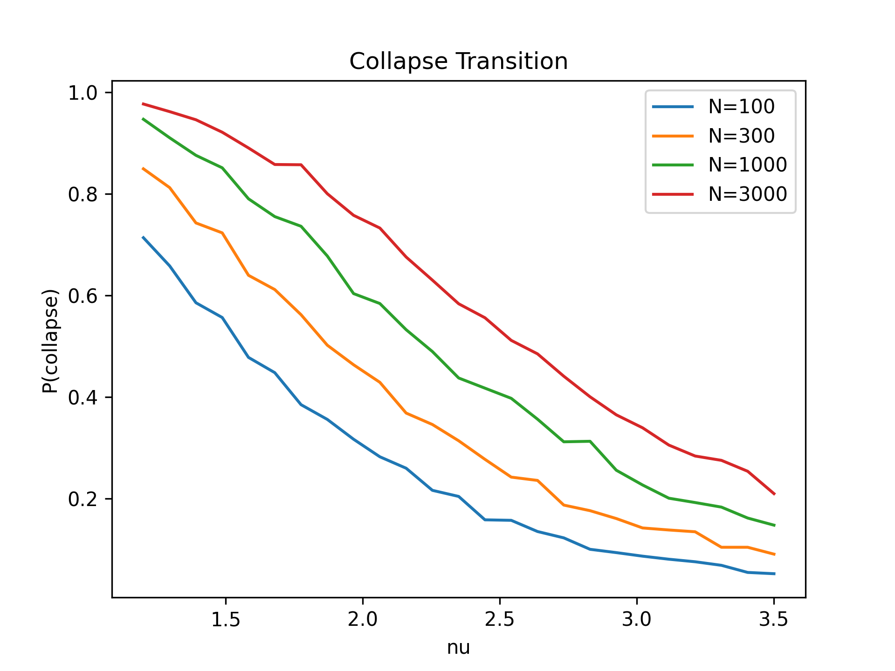
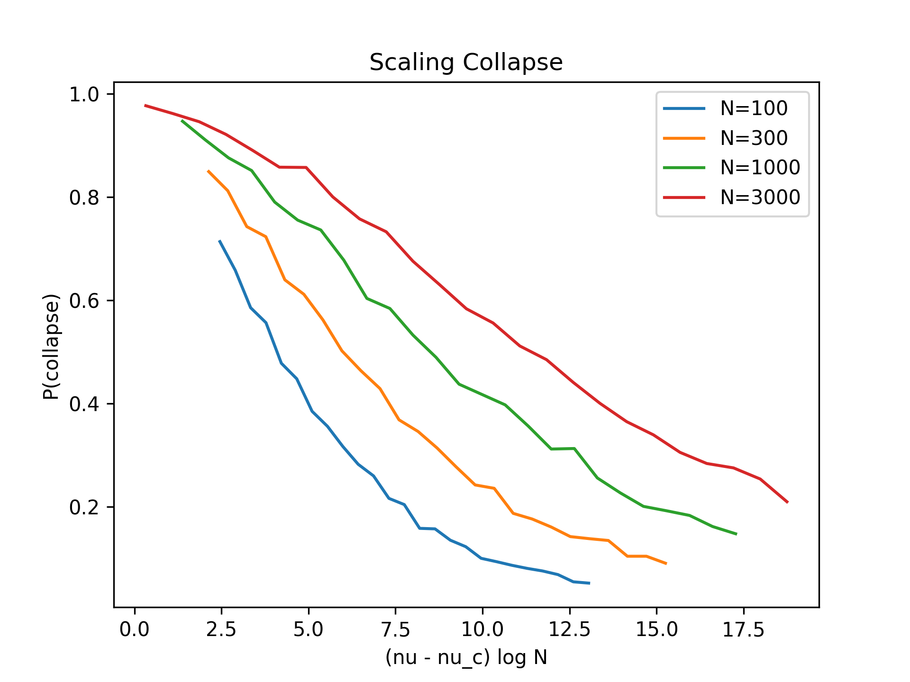
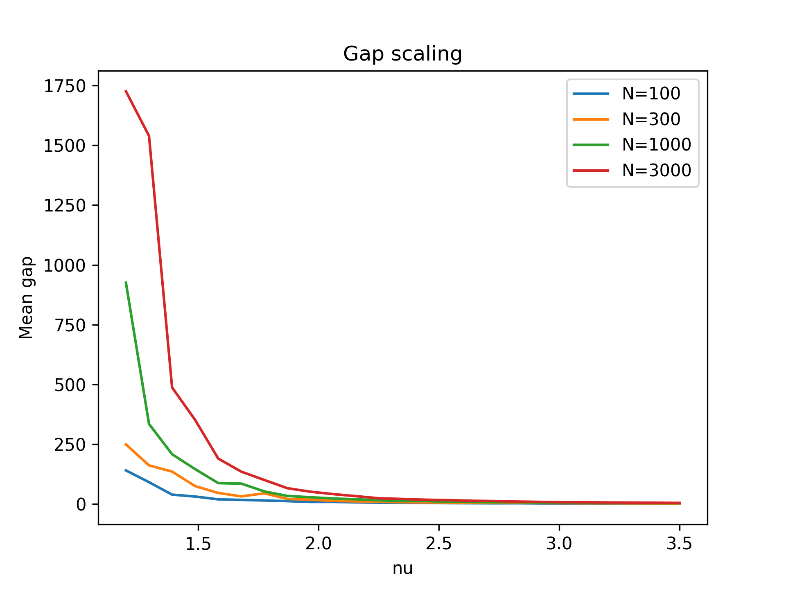

[](https://doi.org/10.5281/zenodo.19425876)

# Tail-Driven Finite-Size Transition in Softmax Collapse

## Overview

This repository presents a scaling theory for the collapse phenomenon in softmax distributions.

We show that softmax collapse can be understood as a **finite-size phase transition** driven by extreme-value statistics of the lower tail of energy distributions.

The mechanism reduces to a simple condition on the **gap between the two smallest energies**, which governs when collapse occurs.

---

## Key Idea

Softmax weights:

w_i = exp(-E_i) / sum_j exp(-E_j)

Define the gap between the two smallest energies:

Δ = E_(2) - E_(1)

Collapse occurs when:

Δ > log(1/ε)

---

## Main Results

* **Extreme-gap reduction**
  Collapse is governed by a two-body variable (minimum gap)

* **Gap scaling (Fréchet-type)**
  Δ ~ N^(1/ν)

* **Finite-size critical point**
  ν_c(N) ~ log(N) / log(1/ε)

* **Scaling law**
  P_collapse = F((ν - ν_c(N)) * log(N))

* **Gumbel-like transition**
  Emerges from thresholding a heavy-tailed variable

---

## Figures

### Phase Transition

Collapse probability sharpens as system size increases.



---

### Scaling Collapse

All curves collapse onto a universal curve under rescaling.



---

### Gap Scaling

The extreme gap grows rapidly for small ν, consistent with EVT predictions.



---

## Reproducibility

Run the simulation:

```bash
python code/simulate.py
```

This will:

* Generate all figures
* Save outputs to `figs/`
* Reproduce the results shown above

---

## Repository Structure

```
.
├── paper.md        # Full theoretical document (LaTeX-style math)
├── code/
│   └── simulate.py # Reproducible simulation
├── figs/           # Generated figures
└── README.md
```

---

## Connection to Particle Filters

Define:

E_i = -log p(y | x_i)

Then softmax weights correspond to particle weights.

Collapse corresponds to particle degeneracy:

* w_max → 1
* Effective Sample Size → 1

---

## Notes

* This is a **finite-size scaling theory**
* The transition depends explicitly on system size N
* The phenomenon is governed by the **lower tail** of the distribution

---

## Status

* Theory: complete
* Numerical validation: complete
* Reproducibility: ensured

---

## Next Steps

* arXiv submission
* Extension to particle filter experiments
* Analytical refinement of scaling function
